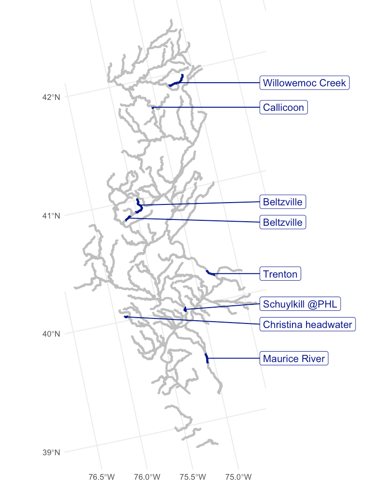
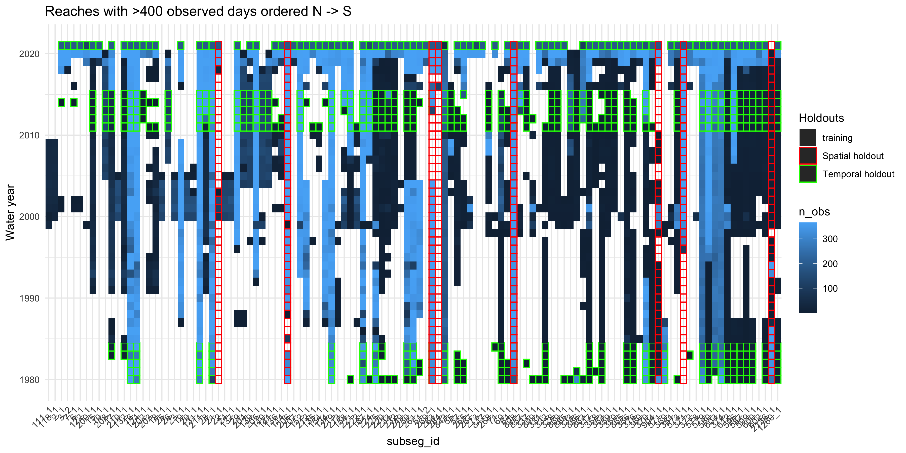

# Explanation of choices for test/train split

May 11th 2021

We sought to create a test set representative of temperature dynamics throughout the Delaware River basin from water year 1980-present.  To minimize the possibility of the correlation between sites and temporal autocorrelation at single sites causing artificially high test performance, we created temporal holdouts (time periods where data from all sites were reserved for testing), and spatial holdouts (sites where all data were reserved for testing).  **In all, this resulted in a train/test split of 66.2%/33.8% for observed temperature reach  days, and 71.4%/28.6% for observed flow reach days.**

__Temporal holdouts__: All data in the water years 1980-84, 2011-15, and 2021 were reserved for the test set.  These windows were chosen to attempt to balance the ability to test on the most recent data (critical to assess performance in an operational setting) and historical periods, while still training on a sufficient amount of modern continuous data.

__Spatial holdouts__: We chose eight reaches of the PRMS network to reserve all data for testing, based on representing key parts of the Delaware basin (mainstem, headwaters, reservoir-adjacent reaches), representing the distribution catchment attributes (e.g. fraction of impervious surfaces) and minimizing the number of observations within a 20 km distance along the network ('fish radius').  Segments are listed north to south.

  - Willowemoc Creek (1455): A headwater reach in the northern part of the basin, for more complete geographic coverage.
  - Delaware River at Callicoon (1578): Covers the northern Delaware mainstem, with much fewer observations within 20km radius compared to Lordville.
  - Pohopoco Creek above and below Beltzville Lake (1703, 1697): Allows testing of model performance above and below a reservoir
  - Delaware River at Trenton (1498): Covers the lower Delaware mainstem.
  - Schuylkill River at Philadelphia (2338): A site with a relatively high percent (> 20%) impervious surface in its catchment.
  - Birch Run (2007): A headwater of the Christina River, also part of a holdout used in a separate study, allowing comparisons
  - Maurice River (above Union Lake) (3570): Part of the southeast portion of the Delaware Basin that drains south directly into Delaware Bay, rather than the Delaware main stem.

Map of spatial holdouts:

Data coverage for reaches with at least 400 observed days:

